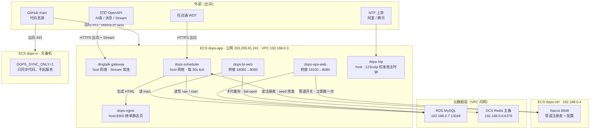
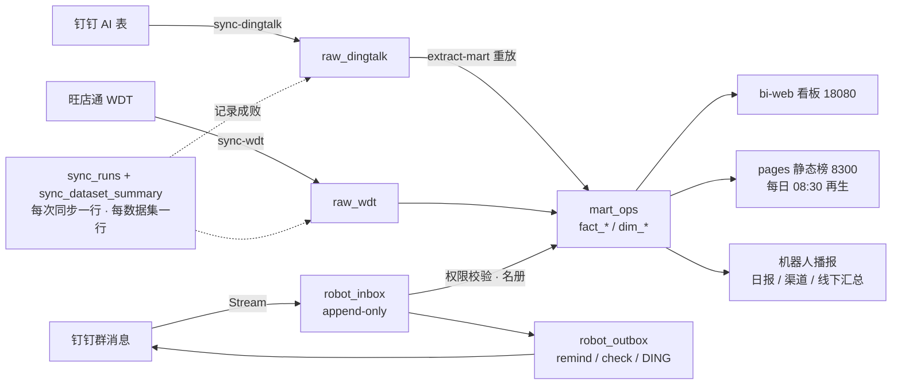

# 新成员接手 · 共同维护提示词（2026-10-07）

> **用法**：把本文件**从 §1 到文末整段复制**，粘贴给一个具备 shell / 文件读写 / 数据库查询能力的编码助手会话（或你自己照着做），即可开工。
> **派发对象**：`<同学名>`（新加入共同维护）。
> **目标**：从零上下文，到「能独立认领并交付一个 P1 级维护任务」，且**不碰坏生产**。
> **交接人**：现有维护者。任何与本文冲突的事实，以**你亲自探查到的为准**，并把修正回填到本文末尾「修正留痕」表。

> **给 WorkBuddy / CodeBuddy 用（推荐）**：本仓库已内置规则文件 `.codebuddy/rules/dops-maintenance.md`（`alwaysApply`），
> 打开仓库即自动加载铁律、环境事实与已知坑，**无需每次粘贴本文**。
> 本文是它的完整版与待办池；两者冲突时以本文为准并同步回规则文件。
> ⚠️ 工作区记忆 `.workbuddy/memory/MEMORY.md` 停留在 2026-09 旧口径（称 ECS「全部测试环境」、生产在「本机 cron」、Git「绝不 push」），
> **已过时，勿据此判断**，以本文为准。

---

## §0 开工前必读（三条铁律，违反即返工）

1. **代码真源只有一个：GitHub `main`。** 云上 `/opt/dops/repo` 是部署副本，**不是**开发分支；任何改动必须先在本地仓库改 → 提 PR → 合 `main`，再由各主机拉模式 CD 自拉。**禁止在云上 repo 里手贴代码。**
2. **生产数据只读优先。** 动任何写操作前先说清：改什么、影响行数、回滚方式、备份文件落在哪。DELETE/UPDATE 生产表一律需要交接人点头。
3. **不知道就说不知道，禁止编造执行结果。** 环境事实（IP、表名、状态、到期时间）一律先探查确认；探查不到就在回复里明写「未确认」，不要猜。

### 三条「绝不」

- 绝不 `git push --force`、绝不 `reset --hard` 别人的分支、绝不删他人 SG 安全组规则（**只加不删**）。
- 绝不 `ALTER` 生产表结构；schema 不符先改 manifest 或停下升级，不回退数据。
- 绝不用 `skip` / 删断言的方式让测试变绿——守门断言只能显式同步，不能绕过。

---

## §1 项目是什么（30 秒版）

`digital-ops` = **公司数字化运营的钉钉机器人 + 数据管道 + 看板**三件套。

- **数据管道（raw → mart）**：从钉钉 AI 表、旺店通（WDT）受限只读抽取 → 落 `raw_*` → `extract-mart` 重放为业务事实表（`fact_*` / `dim_*`）。编排由 `dops-scheduler` + Nacos 管道注册表驱动；每次同步一行 `sync_runs`，每个数据集一行 `sync_dataset_summary`。
- **机器人**：杭州 / 绍兴销售日报（提醒 18:30、催办 20:00）、渠道日销填报（群内报数，权限收口）、万科（已关停）、线下汇总日/周/月播报。机器人消息一律经 `robot_outbox` 出队，`robot_inbox` 收报数（append-only）。
- **对外页面**：榜单静态页（nginx 8300）+ BI 看板（bi-web 18080）。
- **运行形态**：全在天翼云（华东1·南京，非华为云），三台 ECS + RDS + Redis + Nacos，**本机已无 Docker、无本地集成环境**（2026-09-28 起）。

---

## §1.5 一页图：拓扑与数据流（先看这张，再看文字）

### 图一：部署拓扑（谁在哪台机器、哪个端口）



### 图二：数据流（一条数据从哪来、到哪去）



### 端口速查

| 端口 | 服务 | 暴露面 | 备注 |
|---|---|---|---|
| 8300 | `dops-nginx` 榜单静态页 | 公网全开 | 80/443 未备案被拦，临时通道；备案后切回 |
| 18080 | `dops-bi-web` BI 看板 | **仅公司公网 IP** | SG 白名单单点；公司出口 IP 变了必须同步改，否则断 |
| 18100 | `dops-ops-web` 运维台 | **仅运维来源，务必窄于 18080** | 有 admin scope 二次校验；非全员服务 |
| 22 | SSH | 白名单 IP | **只加不删**；`dops-ci`/`dops-ctrl` 需从 dops-app 跳转（SG 拦 VPC 内 22） |
| 123/udp | `dops-ntp` 授时 | 私网三段 + 127.0.0.1 | 不对公网开（防 NTP 放大） |
| 13049 / 6379 | RDS / Redis | VPC 内网 | 不经公网 |

**读图三条**：

1. **出向为主**：代码从 GitHub 拉（出向 443），数据从钉钉/WDT 拉，**零公网入站**（除 SSH 白名单与三个 Web 端口）。机器人靠 Stream 常连，不需要公网回调地址。
2. **两个写数据的通道**：`sync-*` 批量通道（定时）+ 机器人报数 stream 通道（实时）。排查「数据没更新」时**先分清是哪条**，别只看 `sync_runs`。
3. **Nacos 是开关，seed 是兜底**：关一条线要 Nacos + seed 双写，只改一边会在 Nacos 抖动时复活。

## §2 入职前置（找运维要，没齐别动手）

| 项 | 用途 | 状态 |
|---|---|---|
| GitHub 仓库 `digital-ops` 写权限 | 唯一代码真源，走 PR | [ ] |
| SSH 公钥入 dops-app（公网 `203.205.91.241`） | 云上排查；`dops-ci`/`dops-ctrl` 需从 dops-app 跳转（SG 拦 VPC 内 22） | [ ] |
| 本机公网 IP 加入安全组 `sg-dops-app`（TCP 22） | 否则 SSH 超时。**只加不删** | [ ] |
| 凭据副本 `e:/repos/credentials/`（AK/SK、Nacos、regions.values.json） | **不入库、不外传** | [ ] |
| 天翼云 CLI（`ctyun-cli`）可用 AK | 查 ECS 到期 / SG。**必须 `--access-key` 命令行传参**，yaml 里的旧 AK 会抢先生效 | [ ] |
| 榜单页 / BI 访问地址 | `http://203.205.91.241:8300/{hangzhou,shaoxing,vanke,qudao,offline_all}.html`；BI `http://203.205.91.241:18080`（**仅公司公网 IP 可达**，非公司网超时属正常） | [ ] |

---

## §3 变更流程（每一天都按这个走）

```
本地改代码（E:\repos\digital-ops，分支 feat/xxx 或 chore/xxx）
  → 本机跑测试：python -m unittest discover -s tests -t . -v
  → git commit → push → 开 PR → CI（.github/workflows/ci.yml，GitHub Actions）绿
  → 合 main
  → 各主机 systemd timer 触发 ops/deploy.sh 自拉 main（拉模式 CD，失败自动回滚到部署前 SHA）
```

- 部署日志：云上 `/opt/dops/logs/deploy.log`、状态 `/opt/dops/deploy-status.json`。
- **不要手工 SSH 上去 `git pull` + `restart`**：走 deploy timer；确实要手动，先说明原因。
- `dops-ci` 是灾备/CI 机（`DOPS_SYNC_ONLY=1`），**不重启服务**，否则与生产机抢 DingTalk stream。

---

## §4 必读文档（按顺序，读完再领任务）

| 序 | 文件 | 看什么 |
|---|---|---|
| 1 | `README.md` | 目录三层结构、受限读取网关边界、分支流程 |
| 2 | `docs/命令速查表.md` | 全部可执行命令（**注意文首：本地 Docker 类命令已废弃**） |
| 3 | `docs/CICD-全量迁云方案-2026-09-28.md` | 拉模式 CD 全貌 |
| 4 | `docs/上云部署规划.md` + `docs/云主机初始化基线.md` | 拓扑、IPv6 出网防护基线 |
| 5 | `docs/日报催办止血与schema漂移定位-接手执行提示词-2026-09-30.md` | **重点读「附 G 修正轨迹」**：同一现象两次定性翻转的教训 |
| 6 | `docs/渠道日销机器人填报机制方案-2026-09-29.md` | 填报权限口径（只能报自己的店、群管理员可代填） |
| 7 | `docs/BI建设指南.md` | 看板 / 派生指标口径 |
| 8 | `docs/manual-import-channel.md`、`docs/线下整体销售数据自动汇总方案.md` | 渠道与线下两条业务线口径 |

---

## §5 工具箱

**本机（`e:/repos/tools/`，只读探针为主，跑前先读脚本头部注释确认参数）**

> ⚠️ `tools/` **在 `digital-ops` 仓库之外**（同层目录 `e:/repos/tools`），clone 仓库拿不到。
> 新人需单独拷贝一份；若多人长期共用，另开议题决定是否迁入仓库（如 `ops/tools/`）。

- `cloud_health_check.py` —— 云上健康巡检（sync_runs 48h 状态、robot_outbox 72h 投递、超龄 failed、stale started）
- `cloud_run_inspect.py` —— 按 `run_id` 溯源（改脚本里的 RUN_IDS 列表）
- `rds_inventory.py` / `rds_verify.py` / `rds_robot_check.py` —— RDS 盘点与核对
- `nacos_pipelines_check.sh` / `nacos_get_pipeline.sh` / `nacos_set_leaderboard.sh` —— Nacos 管道与配置读写
- `ntp_probe.py` / `ntp_verify.sh` —— 授时排查
- `qudao_*.py` / `aitable_db_sync_check.py` —— 渠道口径核对（AI 表 ↔ DB 逐 ID）

**云上（dops-app 容器内执行，repo 是 bind 挂载、RDS 凭据在容器 env）**

```bash
docker exec -w /opt/dops/repo dops-scheduler python3 <脚本>     # 一次性脚本先 scp 进 repo
docker exec -w /opt/dops/repo dops-scheduler python3 -m common.public_data.cli --help
docker logs --tail 200 dops-scheduler
docker ps --format 'table {{.Names}}\t{{.Status}}'
```

---

## §6 硬坑清单（血泪，逐条记住）

| # | 坑 | 正确做法 |
|---|---|---|
| 1 | `db.connect` 是 **pymysql DictCursor** | 禁 `dict(fetchall())`（单行两列会被捏成 `{'status':'COUNT(*)'}` 假行）；按键取值 |
| 2 | 时间列 **UTC**：`sync_runs.started_at`、`sync_dataset_summary.completed_at`、`raw_*.synced_at` | 但 `robot_outbox.created_at/delivered_at` 是**北京时间**；跨表 join 先确认口径 |
| 3 | 列名：`sync_dataset_summary` 是 `raw_records_written`（不是 `records_written`）；`fact_daily_report_offline` 无 `person_id/fill_date/is_test` | 先 `DESCRIBE` 再写 SQL |
| 4 | 月目标是 **melt 形**（每行重复携带） | 一律 `MAX(monthly_target)`，**绝不 SUM** |
| 5 | 改 `app.env` 后 `docker compose restart` **不生效** | 必须 `docker compose up -d` 重建 |
| 6 | `docker cp` 对只读挂载（scheduler/gateway）失效 | 用 `cat 文件 \| docker exec -i <容器> sh -c 'cat > 路径'` 管道注入 |
| 7 | PowerShell `>` 重定向**毁二进制流** | 远端落盘再 scp；`curl` 是 `Invoke-WebRequest` 别名，用 `curl.exe` |
| 8 | SSH 多行 `python -c` 必炸、PowerShell 吞引号 | 一律**本地写文件 → scp → 远端执行**；`.bat` 走 cmd 绕过引号吞掉 |
| 9 | 同一现象可能有多种定性（见 §4 第 5 篇附 G） | 定性前**逐 sheet / 逐数据集复现**，不能只看 run 级计数 |
| 10 | `sync_runs` 只有 `manifest_sha256`，无 `service_id` | 多 pipeline 共用一份 manifest 时「同 sha 同刻」**极易误判为并发竞争** |
| 11 | 名称含「合计」的行 | 汇总时必须排除 |
| 12 | pymysql 下 `LIKE` 字面量 | `%` 需写成 `%%` |
| 13 | 公网 UDP/123 多数不通（百度/清华源全丢包） | NTP 只用阿里 `ntp.aliyun.com` / 腾讯 `time1.cloud.tencent.com` |
| 14 | 天翼云未 ICP 备案，80/443 被拦 | 榜单临时 8300、BI 18080；切 80/443 需先备案 |

---

## §7 上手路线（Day 1–3，按顺序，不要跳）

### Day 1：只读，把手摸熟（零写操作）

1. 本机跑通测试基线，记录数字：`python -m unittest discover -s tests -t . -v`（预期全绿，量级约 1500 例，以你实测为准）。
2. 跑一次云上健康巡检（`tools/cloud_health_check.py`），输出并留存：48h sync_runs 状态分布、robot_outbox 72h 投递、超龄 failed、stale started run。
3. 打开 5 个榜单页 + BI（在公司网内）各截一次状态，确认可见。
4. 用 `ctyun-cli` 查三台 ECS 的 `expiredTime`，**如实记录**（见 §8 待办 1）。
5. 把 Day 1 结果写进本文末尾「新人首跑记录」。

**Day 1 交付**：一份巡检快照 + 一句「环境是否健康」的结论。**全程零写。**

### Day 2：走通一次完整变更闭环

挑一个**零风险**改动（补文档、补日志、修正文档里过期的事实），从分支 → 测试 → PR → CI 绿 → 合 main 走完一遍。
目的不是改代码，是**把流程跑顺**，并确认你有权限、CI 认识你。

### Day 3：认领一个 P1 任务

从 §8 待办池里认领，开工前先写三件事发给交接人：**改什么 / 怎么验 / 怎么回滚**。

---

## §8 当前待办池（认领制，注明截至 2026-10-07 的状态）

> ⚠️ **本表只作索引，不做分工。** 实际认领与互斥规则见 `docs/维护分工与任务认领表-2026-10-07.md`——
> **开工前先去那张表占 owner**，两人同时维护时以那张表为准。
> 标 **[C0]** 的是钱/服务连续性相关，最优先；状态随进展更新，领走前先确认还有效。

| # | 待办 | 备注 |
|---|---|---|
| 1 | **[C0] 三台 ECS 续费核实** | 记录值 `expiredTime=2026-10-06T03:22:19Z`（已过期，疑宽限期，服务仍在跑）。9-23 记的「已续 1 年 + 自动续费」疑似未生效。**必须控制台核实并手动续费** |
| 2 | 卡死 run 裁决 | `9a04049d`（started，09-23 起）、`c035af4e`（raw_committed，09-29 起）。需裁决置 `failed/aborted` 或留档；注意 stale-started 查询抓不到 `raw_committed` 态 |
| 3 | sync-dingtalk 每日 02:00（北京）批次 `source_read_failed` | 10-01 起连续发生，其余 4 批正常、下一窗口自愈。scheduler 日志只有「退出码 1」无 stderr，需手动复现定位 |
| 4 | 代码真源收敛 | `chore/p1-sync` 有 4 个提交未合 main；云上 repo 有 6 文件大脏树（手贴内容）。PR 合 main 后清理云上 |
| 5 | 停运维本机旧 cron / 启动文件夹 vbs | 旧链路会**抢 DingTalk Stream**，最优先停（需运维亲手操作） |
| 6 | ICP 备案 + 域名 → 切 80/443 | 备案后 BI 进阶段 2（nginx 反代 + 免登凭据 + `BI_WEB_SESSION_SECURE=1`） |
| 7 | 名册 P2 / P3 | P2：机器人名册指令（**需先定义管理群**）；P3：餐饮 / 君品雅院 / 前厅部接入（陈香梅暂缓） |
| 8 | 渠道填报恢复观察 | 全渠道最后真实填报 09-23（私域 09-22）；10-09 后再判。涉及 AI 表 sync 是否退役 + 催办门禁改 inbox 口径 |
| 9 | `junpin` 榜单页管线 | 五个区域里唯一没有页面的 |
| 10 | 巡检告警接 webhook | 方案 §2.4；避免「单表漂移静默拖垮全线 6 天」重演 |
| 11 | 数据备份遗留 | `*_bak_20260923` 共 6 张 RDS 备份表，观察期满后运维 DROP（**需交接人确认，不要自行删**） |

---

## §9 交付规范

- **每次改动必留痕**：改了什么、验了什么、回滚方式，写进对应 `docs/*.md`；一次性任务用「回填表」（步骤 / 动作 / 对象 / 结果 / 回滚 / 负责人 / 时间）。
- **PR 描述模板**：背景 → 改动清单 → 测试与冒烟结论 → 回滚 → 影响面（会不会撞旧 cron / 会不会改口径）。
- **口径类改动**（完成率、月目标、归属、催办名单）**先评审再动手**，禁止「顺手修了」。
- **不确定就升 P0**：遇到可能丢数据、可能停摆、可能误催用户的情形，停下找交接人裁决，不自行拍板。

---

## §10 验收 DoD（新人第一阶段完成判据）

- [ ] 本地测试全绿，基线数字已记录
- [ ] 云上健康巡检快照已产出，能说出「健康 / 不健康 + 依据」
- [ ] ECS 到期状态已核实（待办 1 有结论或已上报）
- [ ] 至少 1 个 PR 走完 `分支 → CI → main → 云上自拉` 全链路
- [ ] 至少 1 个 P1 待办交付，且改动已回填文档
- [ ] 全程：零生产数据误写、零 force push、零 SG 删除

---

## 附：新人首跑记录（Day 1 填）

| 项 | 结果 | 时间 | 执行人 |
|---|---|---|---|
| 本地测试（例数 / 是否全绿） | | | |
| 云上巡检（failed 数 / outbox / stale run） | | | |
| 页面与 BI 可见性 | | | |
| ECS `expiredTime` 实测 | | | |
| 结论：环境是否健康 | | | |

## 附：修正留痕（发现本文与事实不符时追加，勿删上文）

| 日期 | 本文说法 | 实际 | 依据 | 修正人 |
|---|---|---|---|---|
| | | | | |
